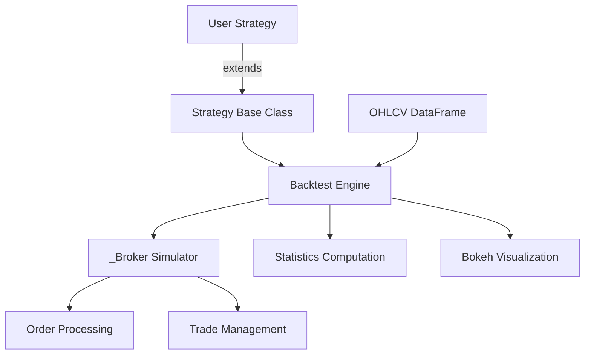

# Backtesting.py

**Lightweight backtesting framework for Python trading strategies**

- **Repository**: [github.com/kernc/backtesting.py](https://github.com/kernc/backtesting.py)
- **Documentation**: [kernc.github.io/backtesting.py](https://kernc.github.io/backtesting.py/doc/backtesting/)
- **License**: AGPL 3.0
- **Language**: Python 3.9+
- **Dependencies**: numpy, pandas, bokeh

## Overview

Backtesting.py is a Python framework for backtesting trading strategies with candlestick (OHLCV) data. It provides a minimal, well-documented API for defining strategies, running backtests, optimizing parameters via grid search, and visualizing results with interactive Bokeh charts. It prioritizes simplicity and ease of use over exhaustive feature coverage, making it ideal for rapid prototyping and education.

## Key Features

| Category | Features |
|----------|----------|
| **Strategy** | Event-driven `init()`/`next()` pattern, progressive data revelation, indicator wrapping via `I()` |
| **Order Types** | Market, limit, stop, stop-limit, bracket (SL/TP), Good 'Til Canceled |
| **Position Mgmt** | Long/short, fractional sizing (0-1 = % of equity), hedging, exclusive orders, FIFO closing |
| **Optimization** | Grid search over parameter space, constraint functions, parallel multiprocessing, heatmap visualization |
| **Statistics** | Sharpe, Sortino, Calmar, CAGR, Alpha/Beta, drawdowns, win rate, SQN, Kelly Criterion, profit factor |
| **Visualization** | Interactive Bokeh charts: OHLC candles, equity curve, drawdown, P/L, volume, indicator overlays |
| **Utilities** | `SignalStrategy`, `TrailingStrategy`, `FractionalBacktest`, `MultiBacktest`, `resample_apply()`, `random_ohlc_data()` |

## Quick Start

Run an SMA crossover backtest with inline data -- no external files or API keys required:

```python
import pandas as pd
import numpy as np
from backtesting import Backtest, Strategy

# Generate inline OHLC data
np.random.seed(42)
dates = pd.date_range("2020-01-01", periods=200, freq="B")
close = 100 * (1 + np.random.randn(200).cumsum() * 0.01)
data = pd.DataFrame({
    "Open": close * (1 + np.random.randn(200) * 0.002),
    "High": close * (1 + abs(np.random.randn(200) * 0.005)),
    "Low": close * (1 - abs(np.random.randn(200) * 0.005)),
    "Close": close,
}, index=dates)

def SMA(values, n):
    return pd.Series(values).rolling(n).mean()

class SmaCross(Strategy):
    n_fast = 10
    n_slow = 30

    def init(self):
        self.sma_fast = self.I(SMA, self.data.Close, self.n_fast)
        self.sma_slow = self.I(SMA, self.data.Close, self.n_slow)

    def next(self):
        if self.sma_fast[-1] > self.sma_slow[-1] and not self.position.is_long:
            self.position.close()
            self.buy()
        elif self.sma_fast[-1] < self.sma_slow[-1] and not self.position.is_short:
            self.position.close()
            self.sell()

bt = Backtest(data, SmaCross, cash=10_000, commission=0.002, exclusive_orders=True)
stats = bt.run()
print(stats)
```

## Architecture Summary



The framework follows a simple three-layer architecture:
1. **Strategy Layer** -- user-defined `init()` and `next()` methods
2. **Engine Layer** -- `Backtest` orchestrator and `_Broker` simulator
3. **Output Layer** -- `_stats` computation and `_plotting` visualization

## Core Components

| Component | Source File | Description |
|-----------|------------|-------------|
| `Strategy` | `backtesting.py` | Abstract base class for user strategies; manages indicators and order placement |
| `Backtest` | `backtesting.py` | Main entry point; runs strategies on data, supports optimization |
| `Order` | `backtesting.py` | Represents pending orders with limit/stop/SL/TP parameters |
| `Trade` | `backtesting.py` | Active or closed position with P&L, SL/TP management |
| `Position` | `backtesting.py` | Aggregated view of current trades |
| `_Broker` | `backtesting.py` | Internal broker simulation; processes orders bar-by-bar |
| `compute_stats` | `_stats.py` | Computes performance metrics from trades and equity curve |
| `plot` | `_plotting.py` | Generates interactive Bokeh charts |
| `lib` | `lib.py` | Utility functions, composable strategy classes, multi-backtest support |
| `_Data` | `_util.py` | High-performance OHLCV data accessor wrapping numpy arrays |

## Documentation

- [Architecture](architecture.md) -- System design, component interactions, data flow diagrams
- [Workflow](workflow.md) -- Backtesting pipeline, order execution, optimization flows
- [State Management](state-management.md) -- Order state machine, position tracking, strategy lifecycle
- [Development](development.md) -- Setup, strategy creation guide, custom indicators, testing
