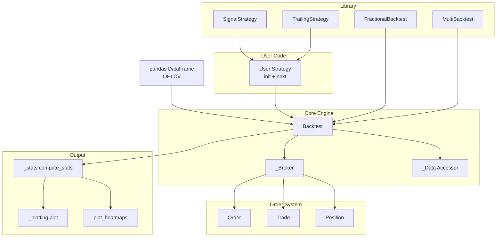
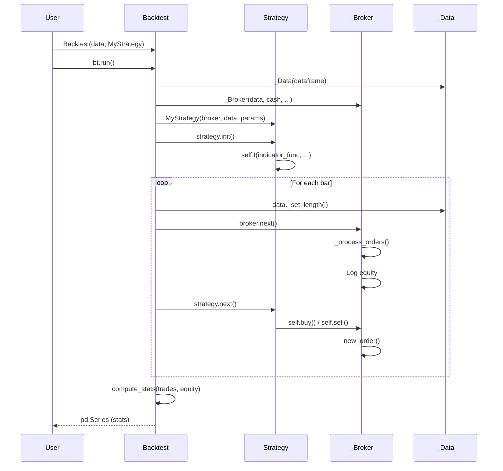
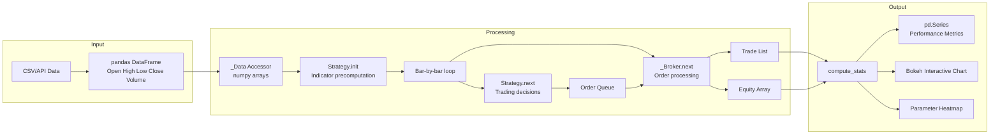
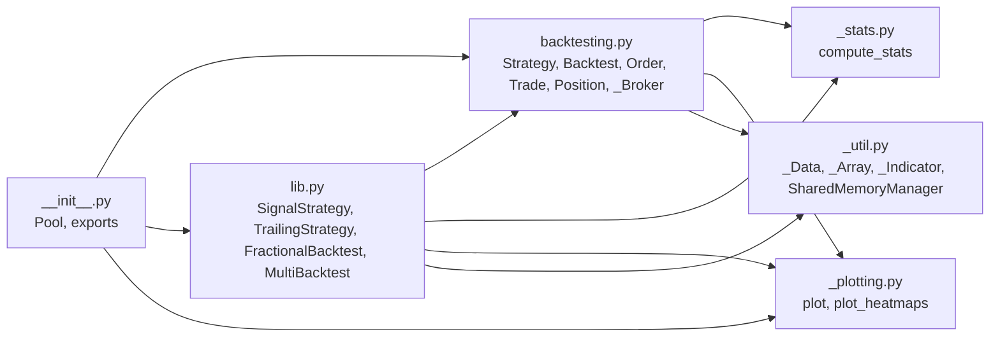

# Backtesting.py -- Architecture

## System Architecture

## Trading Paradigm & Key Features

| Feature | Support | Details |
|---------|---------|---------|
| Backtesting Approach | Vector-based | Pandas-based vectorized backtesting; indicators precomputed over full data, bar-by-bar execution via `next()` |
| Live Trading | No | Backtesting only; no broker connectivity |
| Paper Trading | No | No built-in paper trading mode |
| Multi-Asset | Limited | Single-asset per backtest; `MultiBacktest` in `lib.py` runs multiple assets sequentially |
| Data Feeds | CSV / pandas DataFrame | Any OHLCV DataFrame with DatetimeIndex; integrates with yfinance, custom APIs |
| ML Integration | No | No built-in ML support; custom indicators can wrap ML models via `self.I()` |
| Risk Management | Built-in | Stop-loss, take-profit, trailing stops (via `TrailingStrategy`), position sizing (fractional or absolute) |
| Optimization | Yes | Grid-search parameter optimization with multiprocessing; `plot_heatmaps()` for visualization |
| Execution | Simulated | Internal `_Broker` with commission, margin, slippage simulation; no live broker integration |

## Core Components Breakdown

### Strategy (`backtesting.py:41-326`)

The `Strategy` abstract base class is the primary user-facing interface. Users subclass it and implement two methods:

- **`init()`** -- Called once before the simulation. Full-length data arrays are available for precomputing indicators. Indicators are declared via `self.I(func, *args)`, which wraps the return value in an `_Indicator` array that progressively reveals values during `next()`.

- **`next()`** -- Called for each bar. Data arrays are truncated to the current bar index, simulating real-time data arrival. Trading logic goes here: `self.buy()`, `self.sell()`, position checks, SL/TP management.

Key properties: `data`, `position`, `orders`, `trades`, `closed_trades`, `equity`.

### Backtest (`backtesting.py:1083-end`)

The `Backtest` class orchestrates the simulation:

1. Validates and prepares OHLCV data
2. Creates `_Broker` and `Strategy` instances
3. Calls `strategy.init()` for indicator precomputation
4. Iterates bar-by-bar, calling `broker.next()` then `strategy.next()`
5. Collects equity curve and closed trades
6. Computes statistics via `_stats.compute_stats()`

Also provides `optimize()` for grid-search parameter optimization using multiprocessing.

### _Broker (`backtesting.py:725-1081`)

The internal broker simulates order execution:

- **Order queue**: Orders are processed each bar against current OHLC prices
- **Stop/limit logic**: Checks if stop/limit conditions are met within the bar's high/low range
- **Position sizing**: Fractional sizes (0 < size < 1) are converted to units based on available margin
- **FIFO closing**: Without hedging, opposite-facing orders close existing trades first
- **Commission model**: Fixed + relative, or custom callable
- **Margin tracking**: Ensures sufficient margin before opening trades

### _Data (`_util.py:156-248`)

A custom data accessor that wraps a pandas DataFrame but returns numpy arrays for performance. Provides `Open`, `High`, `Low`, `Close`, `Volume` properties and supports progressive length truncation for the `next()` simulation loop.

### Statistics (`_stats.py:37-213`)

`compute_stats()` generates a comprehensive `pd.Series` of performance metrics:

- Return metrics: total return, annualized return, CAGR, buy & hold comparison
- Risk metrics: volatility, Sharpe ratio, Sortino ratio, Calmar ratio, Alpha/Beta
- Drawdown analysis: max drawdown, avg drawdown, duration peaks
- Trade metrics: win rate, best/worst trade, profit factor, expectancy, SQN, Kelly criterion

### Plotting (`_plotting.py`)

Generates interactive Bokeh charts with multiple panels:
- OHLC candlestick chart with indicator overlays
- Equity curve with drawdown visualization
- Profit/loss scatter plot per trade
- Volume bars
- Linked crosshair and zoom across all panels

## Component Interaction Diagram

## Data Flow Diagram

## Module Dependencies

---
## See Also
- [README](README.md) — Project overview and quick start
- [Workflow](workflow.md) — Event flows and processing pipelines
- [State Management](state-management.md) — State lifecycle and data models
- [Development](development.md) — Development guide and best practices
