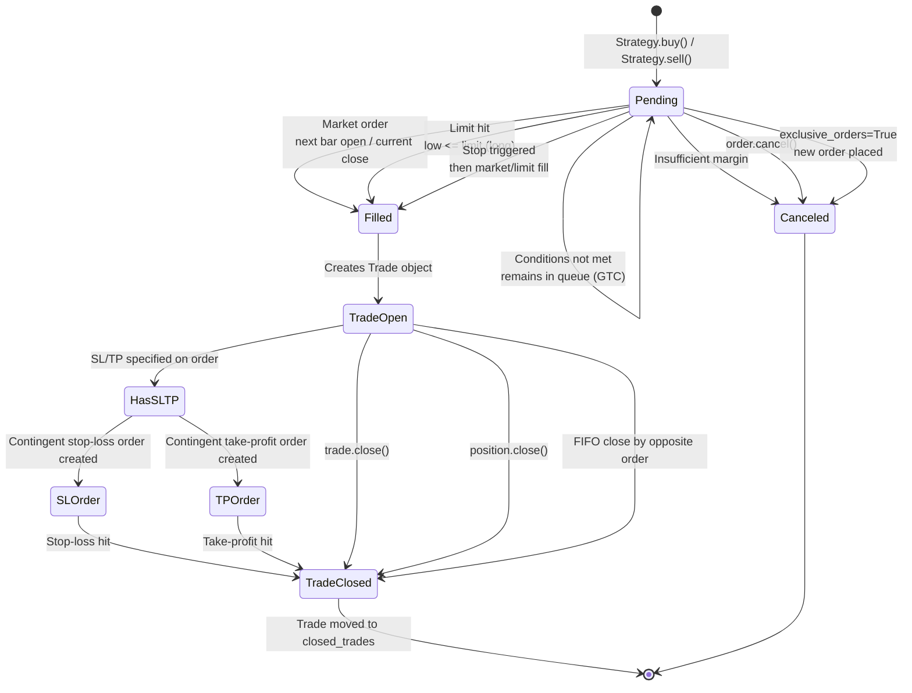
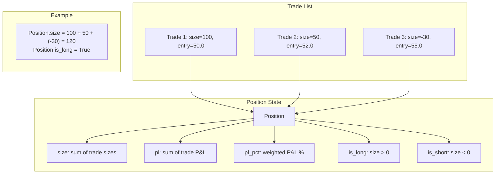
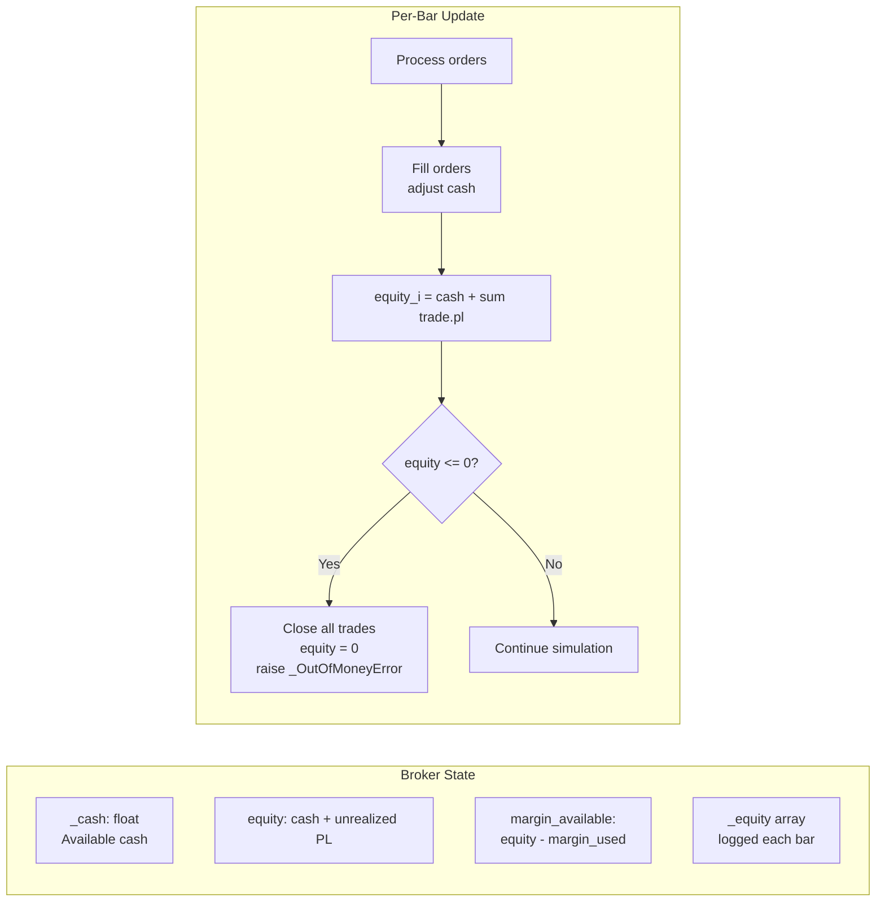
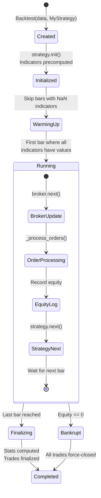
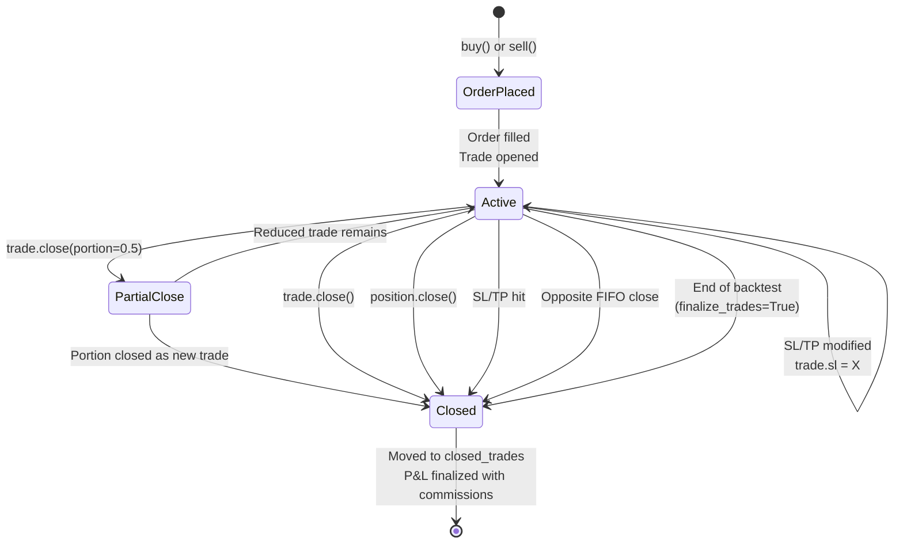
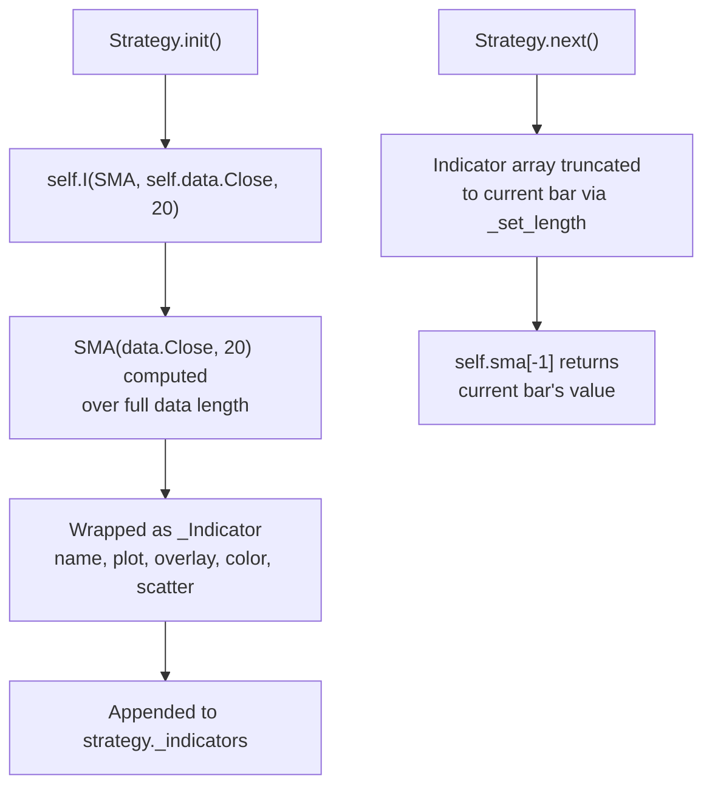

# Backtesting.py -- State Management

## Order State Machine



### Order Types and Fill Logic

| Order Type | Created By | Fill Condition | Fill Price |
|-----------|-----------|----------------|------------|
| **Market** | `buy()` / `sell()` with no limit/stop | Immediate (next bar) | Next open or current close |
| **Limit** | `buy(limit=X)` | `Low <= X` (long) or `High >= X` (short) | Limit price |
| **Stop-Market** | `buy(stop=X)` | `High >= X` (long) or `Low <= X` (short) | Max(open, stop) long / Min(open, stop) short |
| **Stop-Limit** | `buy(stop=X, limit=Y)` | Stop hit first, then limit condition | Min(stop, limit) long / Max(stop, limit) short |
| **SL (contingent)** | Auto on `buy(sl=X)` | Stop-market on parent trade | Stop price |
| **TP (contingent)** | Auto on `buy(tp=X)` | Limit on parent trade | Limit price |

## Position Tracking



### Position vs Trade Model

Backtesting.py distinguishes between individual `Trade` objects and the aggregate `Position`:

- **Trade**: A single fill with entry price, entry bar, optional SL/TP, and P&L tracking. Trades are stored in `broker.trades` (active) or `broker.closed_trades` (settled).
- **Position**: A read-only aggregate view computed from all active trades. `position.size` is the sum of all trade sizes. `position.close()` closes all active trades.

With `hedging=True`, long and short trades can coexist. With `hedging=False` (default), new opposite-facing orders first close existing trades via FIFO.

## Portfolio / Equity State



### Equity Tracking

The broker maintains an equity array (`_equity`) indexed by bar number:
- At each bar, `equity[i] = cash + sum(trade.pl for active trades)`
- If equity drops to zero or below, all trades are force-closed and the simulation stops
- The equity curve is used to compute drawdown, returns, and all risk metrics

### Cash Flow

```
Initial Cash
  - commission on trade open (deducted from cash at open time)
  + trade P&L - commission on trade close (added to cash at close time)
  = Current Cash
```

Commission is applied twice per trade: once at entry and once at exit. The entry commission is calculated using the final trade size (which may differ from the original order size due to `_reduce_trade()`).

## Strategy Lifecycle States



## Trade Lifecycle



### Trade Properties While Active

| Property | Description |
|----------|-------------|
| `size` | Number of units (negative for short) |
| `entry_price` | Fill price at trade open |
| `exit_price` | `None` while active |
| `pl` | Unrealized P&L: `size * (current_close - entry_price)` |
| `pl_pct` | Unrealized return percentage |
| `value` | `abs(size) * current_price` |
| `sl` | Current stop-loss price (writable) |
| `tp` | Current take-profit price (writable) |
| `tag` | User-defined tracking tag |

### Trade Properties When Closed

| Property | Description |
|----------|-------------|
| `exit_price` | Fill price at trade close |
| `exit_bar` | Bar index when closed |
| `pl` | Realized P&L including commissions |
| `_commissions` | Total commission (entry + exit) |

## Indicator State

Indicators declared via `Strategy.I()` are `_Indicator` objects (subclass of `numpy.ndarray`):



The warmup period is determined by finding the first bar where all declared indicators have non-NaN values. The backtest simulation begins at this bar.

---
## See Also
- [README](README.md) — Project overview and quick start
- [Architecture](architecture.md) — System design and components
- [Workflow](workflow.md) — Event flows and processing pipelines
- [Development](development.md) — Development guide and best practices
