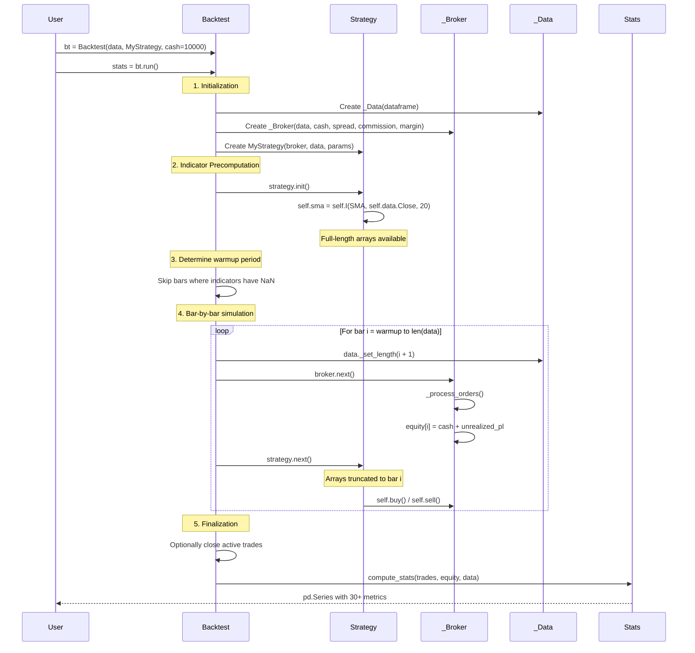
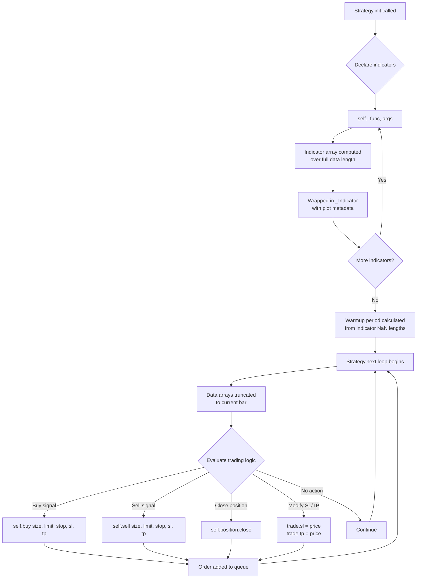
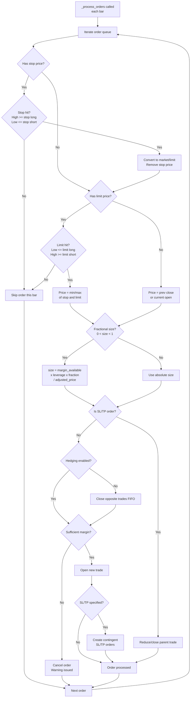
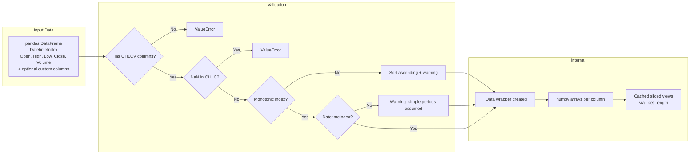
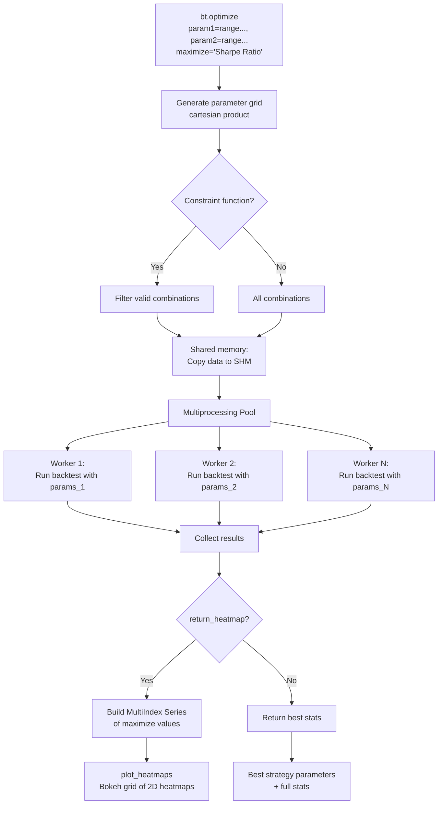

# Backtesting.py -- Workflow

## Backtesting Pipeline



## Strategy Execution Flow



## Order Processing Flow



## Data Feed Handling

Backtesting.py uses a simple, pandas-based data model:



Data is accessed in `Strategy` via `self.data`:
- `self.data.Close` -- numpy array (truncated in `next()`)
- `self.data.Close.s` -- pandas Series with datetime index
- `self.data.df` -- full DataFrame slice

## Optimization Flow



### Optimization Example

```python
stats, heatmap = bt.optimize(
    n1=range(5, 30, 5),
    n2=range(10, 70, 5),
    maximize='Sharpe Ratio',
    constraint=lambda p: p.n1 < p.n2,
    return_heatmap=True
)
```

The optimizer:
1. Generates all `(n1, n2)` combinations where `n1 < n2`
2. Runs backtests in parallel across CPU cores
3. Returns the parameter set that maximizes the Sharpe Ratio
4. Optionally returns a heatmap Series for visualization

## Walk-Forward Analysis

Backtesting.py does not include built-in walk-forward analysis, but it can be implemented manually:

```python
from backtesting import Backtest, Strategy

# Split data into windows
for train_start, train_end, test_start, test_end in windows:
    train_data = data[train_start:train_end]
    test_data = data[test_start:test_end]

    # Optimize on training window
    bt_train = Backtest(train_data, MyStrategy)
    stats = bt_train.optimize(n1=range(5, 50), n2=range(10, 100),
                               maximize='Sharpe Ratio',
                               constraint=lambda p: p.n1 < p.n2)

    # Test on out-of-sample window
    bt_test = Backtest(test_data, MyStrategy)
    oos_stats = bt_test.run(n1=stats._strategy.n1, n2=stats._strategy.n2)
```

## Monte Carlo Simulation

The `random_ohlc_data()` generator enables robustness testing:

```python
from backtesting.lib import random_ohlc_data

generator = random_ohlc_data(real_data, frac=1.0, random_state=42)
results = []
for _ in range(1000):
    random_data = next(generator)
    bt = Backtest(random_data, MyStrategy)
    stats = bt.run()
    results.append(stats['Sharpe Ratio'])
```

---
## See Also
- [README](README.md) — Project overview and quick start
- [Architecture](architecture.md) — System design and components
- [State Management](state-management.md) — State lifecycle and data models
- [Development](development.md) — Development guide and best practices
